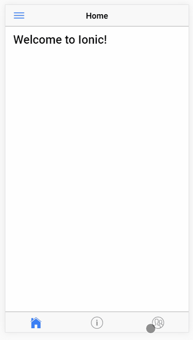

# ionic2-tabs-and-menu

This is an ionic 2 

## Getting Started

* Clone this repository: `'
* run `npm install` from the project root
* Install the ionic CLI (`npm install -g ionic`)
* Run `ionic serve` from th project root
* Profit
